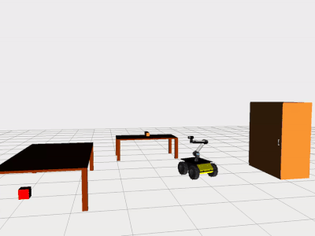
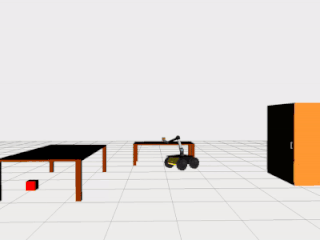
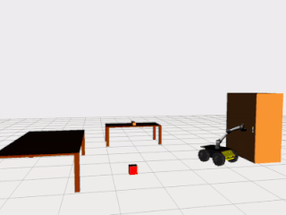
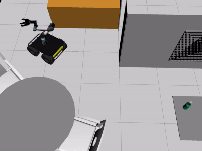
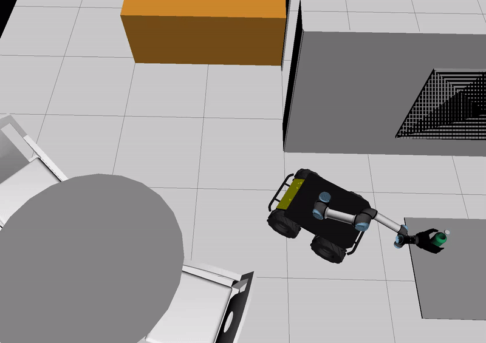
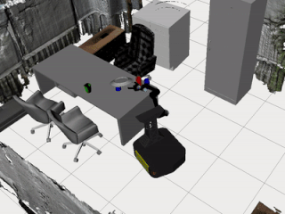
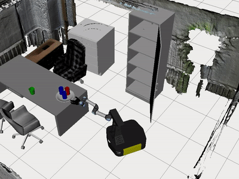

# Planning-on-VKC

  

A motion planning framework for virtual kinematic chain.

*Only tested with ROS Noetic for Ubuntu 20.04.*

## 1. Installation

Firstly, following dependencies need to be manually installed and set up.
- [ROS Noetic](http://wiki.ros.org/noetic/Installation): we use ROS noetic as our basic platform.
- [Gurobi Optimizer](https://www.gurobi.com/downloads/gurobi-optimizer-eula/): For Gurobi download and licensed, you need to register an account first (Free academic use if you have an .edu email). An detail installation documentation is available [here](https://www.gurobi.com/documentation/).

After installing the aforementioned dependencies, follow steps below to setup the environment

Before compiling our package, several system dependencies needs to be installed, use following command to install

```bash
sudo apt install python3-catkin-tools ros-noetic-octomap-msgs ros-noetic-octomap \
ros-noetic-ompl ros-noetic-octomap-ros ros-noetic-lms1xx ros-noetic-ifopt
```


Then download our package and extract files into `projects` folder.

```bash
cd projects
git clone --recurse-submodules <github-package-url>
cd <github-package-folder>
rosdep install --from-paths src --ignore-src -r -y
catkin build
```

where `<github-package-url>` is the GitHub download URL of our package.

*Note: Use `--dry-run` to list the packages which will be built.*


## 2. Run Examples

### 2.1 Examples come with tesseract package:

``` bash
source <path-to-src>/devel/setup.bash
roslaunch tesseract_ros_example <example-name>.launch
```

### 2.2 Examples come with vkc package:

#### 2.2.1 Example of using stick to pick ball:
The demo shows how a robot tries to pick an object with a tool and to operate articulated object such as opening the door of a cabinet.
``` bash
source <path-to-src>/devel/setup.bash
roslaunch vkc_example household_env.launch
```
       
#### 2.2.2 Example of loading scene URDF with build-in module:
The demo shows vkc being able to modify scene graph after loading it from urdf to inverse the kinematics chain, and then plan a motion task basing on the new scene graph.
``` bash
source <path-to-src>/devel/setup.bash
roslaunch vkc_example load_vkc.launch
```
    
#### 2.2.2 Example of big task planning for complex tasks:
The demo provides as many as five scenarios of motion planning tasks, and they show different abilities of motion planning to finish one sub-task. Using tool-like objects, containers, as well as clearing obstacles from the moving path are the main idea of the demo that wants to convey.  Without modifying the source code and recompiling the project, it is still possible to switch among demo scenarios by changing the value of arg demo_index in the launch file vkc_big_task.launch. Comments are there to help you make decision. 
``` bash
source <path-to-src>/devel/setup.bash
roslaunch vkc_example vkc_big_task.launch
```
        
